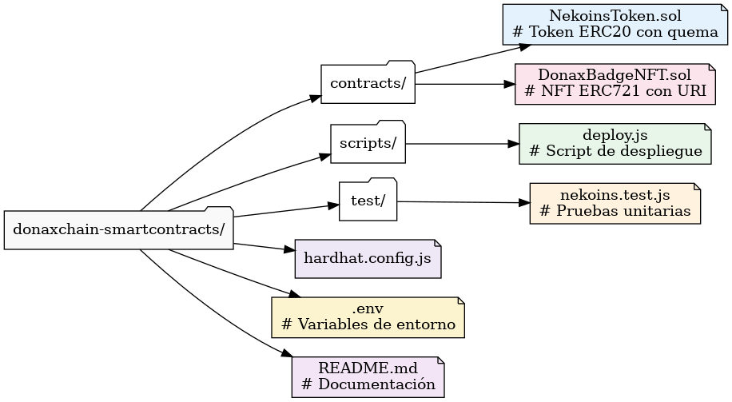

# 🐱💠 DonaxChain Smart Contracts

Bienvenido al repositorio oficial de los **Smart Contracts del ecosistema DonaxChain**, una plataforma blockchain orientada a la trazabilidad de donaciones solidarias, utilizando el token **$NEKOINS** y NFTs conmemorativos **DonaxBadges**.

---

## 📦 Contenido del Proyecto

Este repositorio contiene:

- 🪙 `NekoinsToken.sol` – Token ERC20 con quema automática y emisión controlada.
- 🎖 `DonaxBadgeNFT.sol` – NFT ERC721 que reconoce logros solidarios.
- 🧪 Scripts para despliegue y pruebas.
- 📄 Instrucciones detalladas para compilar y desplegar en testnet (Sepolia).

---

## 🧠 ¿Qué es DonaxChain?

> Una plataforma descentralizada donde donar tiene recompensa real. Cada acción solidaria se registra en blockchain, emitiendo tokens y NFTs que fomentan una comunidad activa y transparente.

---

## 📁 Estructura de carpetas




---

## 🔧 Requisitos

Antes de comenzar, asegúrate de tener instalado:

- Node.js `>=16.x`
- Hardhat `^2.x`
- MetaMask (configurada con la testnet Sepolia)
- Cuenta en [Alchemy](https://alchemy.com/) o [Infura](https://infura.io/) para RPC

---

## 🚀 Instalación y Compilación

```bash
# Clonar el repositorio
git clone https://github.com/tuusuario/donaxchain-smartcontracts.git
cd donaxchain-smartcontracts

# Instalar dependencias
npm install

# Compilar los contratos
npx hardhat compile

🧪 Despliegue a Sepolia
Crear archivo .env:

ini
Copiar
Editar
PRIVATE_KEY=TU_LLAVE_PRIVADA
API_URL_SEPOLIA=https://sepolia.infura.io/v3/TU_API_KEY
Ejecutar el script:

bash
Copiar
Editar
npx hardhat run scripts/deploy.js --network sepolia

🪙 Detalles del Token $NEKOINS
Propiedad	Valor
Nombre	NEKOINS
Símbolo	NEK
Decimales	18
Emisión inicial	40,000,000
Suministro total	100,000,000 máximo
Quema automática	0.5% por transacción
Emisión anual	10M por año (inflación controlada)

🎖 NFT DonaxBadge
NFT único emitido por logros como:

Primera donación 🤝

Campaña completada 🏅

Ayuda continua mensual 🧡

Cada NFT contiene metadatos personalizados con imagen y descripción de la acción solidaria.

✅ Estado del Proyecto
 Contrato ERC20 funcional

 Contrato ERC721 funcional

 Integración completa en dApp (en progreso)

 Contrato DAO (en planificación)

👨‍💻 Autores
Felipe Reyes Ingunza – Fullstack Dev & Visionario Web3

Proyecto académico para curso de Blockchain – 2025

📜 Licencia
Este proyecto está licenciado bajo MIT License.
Puedes usarlo, adaptarlo o expandirlo para fines educativos o sociales 🌍✨

🌐 Recursos útiles
Remix IDE

OpenZeppelin Docs

Hardhat

Sepolia Faucet

yaml